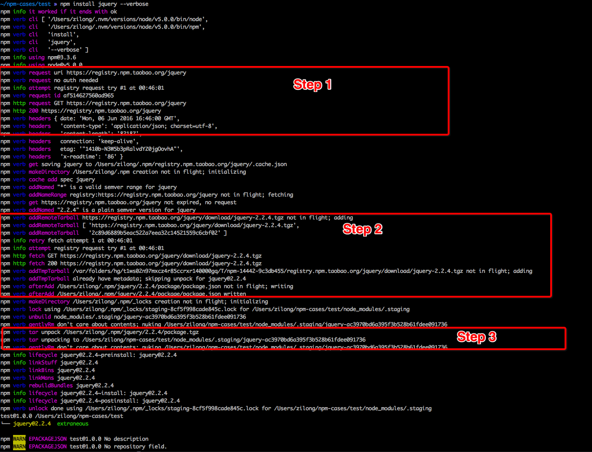

### 自我介绍

### 现阶段RN的进展和缺陷

###### 大规模应用之前，需要解决的缺陷
1. 单JSCore，跨部门合作
 - bundle拆分，react-native-packager改造
 - JSCore加载JS方式的改造，需要能够
 -

2. 没有合适的Router
3. 未有1.0版本，接口并非稳定
4. 包依赖众多，无法构成稳定的跨平台开发、打包、测试环境。

###### 官版基本原理和源代码结构
1. 一个框架，一个命令，三个NPM包
2. 单JSCore，单Bundle

针对问题1和2
这是NPM的锅，也是今天主要讨论的问题，我们先看看问题是怎么产生的。

### 推演包依赖问题的产生的原因
##### 单组应用
开始一个新的项目，基本上是这样的。第一个人建立起基本的项目模板：

    npm install react-native-cli -g
    react-native init AwesomeProject
    npm shrinkwrap
    git push

其他开发者：

    npm install react-native-cli -g
    git clone
    npm install

react-native init AwesomeProject这一步，约等于

    mkdir AwesomeProject && cd AwesomeProject
    npm install react-native --save
    copy模板（index.ios.js等）

npm shrinkwrap这一步在项目根目录下产生了一个npm-shrinkwrap.json文件，<b>这个文件锁定了整个项目依赖的第三方组件版本</b>。因为npm上众多的源采用Semantic的版本标准，不可避免的出现这样的情况
> A@0.0.1 -> ^B@0.0.1

项目中运用了A@0.0.1的模块，依赖树可能是这样的
> project -> A@0.0.1 -> B@0.0.1

当B模块发布了0.0.2版本后，其他开发者重新clone代码仓库并且npm install之后，依赖树就变成
> project -> A@0.0.1 -> B@0.0.2

npm-shrinkwrap.json则可以避免这一问题的产生，因为npm install命令在构建依赖树时，package.json和npm-shrinkwrap.json文件都会产生影响，npm-shrinkwrap.json的优先级更高。

shrinkwrap这一步非常重要，他保证了项目依赖树不会随着时间推移而产生变化。它保证开发、测试和上线这样一段时间内，每次构建的时候，产生的内容一致。

##### 跨团队合作
Shrinkwrap跨团队失效

##### Win，Linux，Mac
Shrinkwrap跨平台不稳定

<!-- npm2，npm3策略不同 -->

### 挖一挖npm publish和npm install命令，看看npm-shrinkwrap.json怎么影响install过程
##### npm publish命令
众所周知，npm publish是将模块发布到npm源的命令。publish过程是什么？我们找个模块来看看。

看来publish主要分为两步：
1. 将代码打成tgz包，并放在npm的cache目录下。在这一步，.npm-ignore文件和package.json内的files字段配置都可以配置tgz所包含的内容。在不做任何配置的情况下，npm-shrinkwrap.json会被压进tgz包。
2. 上传tgz并更新npm源。

#### npm install jquery
我们运行npm install jQuery --save --verbose，从日志来简单看看npm install命令会发生什么事情。这里挑选jQuery作为例子，因为jQuery是最常用却并不依赖其他模块（所以jQuery包里没有npm-shrinkwrap.json)，有助于我们厘清单个模块的安装顺序。

可以看到，对最简单的一个模块的install过程，主要分为3步
1. 从[https://registry/jquery](https://registry/jquery)上获取安装包的信息，包含了版本历史、依赖、作者和各个版本的tgz下载链接等等。
2. 下载第一步的结果得知的tgz链接。
3. 解压缩。

### 方案

### 总结
